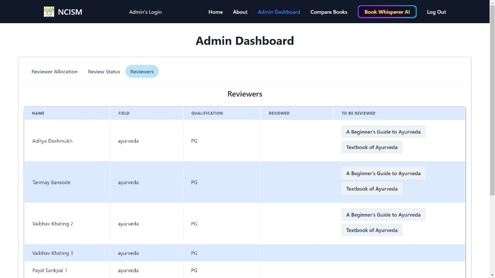

# TextBook Evaluation Portal - Visual Documentation

This document provides a comprehensive visual walkthrough of our TextBook Evaluation Portal developed for the Ministry of Ayush & AICTE during Smart India Hackathon 2023.

## Table of Contents

- [Landing Page](#landing-page)
- [Admin Dashboard](#admin-dashboard)
- [Author Dashboard](#author-dashboard)
- [Reviewer Dashboard](#reviewer-dashboard)
- [Review Process](#review-process)
- [AI Integration](#ai-integration)
- [Plagiarism Detection](#plagiarism-detection)
- [Peer-to-Peer Comparison](#peer-to-peer-comparison)
- [Report Generation](#report-generation)
- [Communication System](#communication-system)

## User Landing Page

The landing page serves as the entry point for students 

- Quick access to top-rated textbooks
- Login/Registration options for different user roles
- Peer-		to-Peer book comparison

## Admin Dashboard

The Admin Dashboard is the control center for system administrators, allowing them to manage the entire evaluation process.

### Main Dashboard View

The main dashboard provides administrators with:

- Overview statistics of books in various stages of review
- Recent activity timeline
- Pending tasks requiring immediate attention
- System health metrics

### Book Acceptance Interface

This interface allows administrators to:

- Review completed evaluations
- Accept books that meet the quality standards
- View detailed assessment scores across all criteria
- Add administrative notes before final acceptance

### Reviewer Allocation System

This section enables administrators to:

- Assign appropriate reviewers to submitted books
- Match reviewers' expertise with book subject matter
- Balance reviewer workload
- Track allocation status and progress

### Extended Dashboard View

Additional administrative features include:

- Analytics on reviewer performance
- Historical data of Reviewers

## Author Dashboard

The Author Dashboard provides book authors with:

- Status updates on submitted books
- Feedback from reviewers
- Options to submit revised versions
- Plaigiarism Check
- Notifications about evaluation progress

## Reviewer Dashboard

### Main Reviewer Interface

The Reviewer Dashboard includes:

- List of books assigned for review
- Progress tracking for ongoing reviews
- Access to the standardized evaluation form

### Analytics and Performance

This section shows reviewers:

- Their review history and patterns
- Review Process

### Evaluation Form

The digital implementation of NCISM's Textbook Quality Assessment Scale includes:

- Author credibility assessment
- Publisher credibility verification
- Physical appearance and structure evaluation
- Subject matter quality rating
- Language standards check
- Illustration quality assessment
- Ethical compliance verification

## AI Integration

Our "Book Whisperer AI" feature provides:

- Automated preliminary assessment of submitted books
- Content summarization for quick review
- Quality indicators based on text analysis
- Suggestions for areas requiring detailed human review
- Language and structure evaluation

## Plagiarism Detection

### Plagiarism Check Interface

Our advanced plagiarism detection system:

- Highlights potential content duplication
- Provides similarity scores
- Identifies original sources

### Detailed Source Analysis

This detailed view shows:

- Specific passages with potential plagiarism
- Links to original source material
- Percentage of similarity
- Timeline of publication to establish precedence

## Peer-to-Peer Comparison

### Book Comparison Interface

This feature allows for:

- Side-by-side comparison of books on similar topics
- Evaluation score comparison across all criteria
- Content coverage analysis
- Quality benchmarking

### Visual Comparison Analytics

The visual analytics dashboard provides:

- Radar charts comparing multiple evaluation dimensions
- Trend analysis across different editions or similar books
- Strengths and weaknesses visualization
- Quality percentile ranking

## Report Generation

Our system automatically generates comprehensive PDF reports that include:

- Complete evaluation scores across all criteria
- Reviewer comments and suggestions
- Comparison with quality benchmarks
- Recommendations for improvements
- Official certification of quality (for accepted books)

## Communication System

The integrated communication system:

- Sends automated notifications at each stage of the review process
- Delivers feedback to authors
- Alerts administrators about pending actions
- Provides reviewers with assignment notifications
- Issues certificates and official recommendations for approved textbooks

---

This TextBook Evaluation Portal represents a comprehensive digital implementation of NCISM's quality assessment framework, bringing efficiency, transparency, and consistency to the textbook evaluation process for Indian Systems of Medicine.
