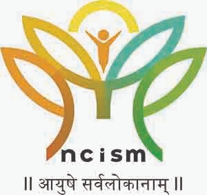

    

# TextBook Evaluation Portal for Ministry of Ayush & AICTE



This project was our winning submission for the Smart India Hackathon (SIH) 2023, addressing a problem statement from the Ministry of Ayush. Our team "BroCoders" developed this solution over an intensive 36-hour hackathon and emerged as winners in our category.

Documentation link(for viewing dashboards and features in detail): [project-documentation.md](./project-documentation.md)

PPT link: [SIH1340_24023_BroCoders.pdf](./SIH1340_24023_BroCoders.pdf)

## 📚 Problem Statement

The Indian System of Medicine (Ayurveda, Unani & Siddha) faces significant challenges in maintaining quality standards in educational textbooks:

- Many textbooks claim to follow NCISM/CCIM syllabi but vary drastically in quality
- No standardized framework exists for institutions to identify and recommend quality textbooks
- Students often rely on substandard materials, affecting education quality
- Regulatory bodies lack objective criteria for recommending textbooks

The National Commission for Indian System of Medicine (NCISM) has developed a comprehensive Textbook Quality Assessment Scale, but its implementation remains challenging without a streamlined digital solution.

## 💡 Our Solution

We built a comprehensive platform that digitizes the entire textbook evaluation process according to NCISM's assessment criteria. Our portal connects Authors, Reviewers, Administrators, and Users in a collaborative ecosystem that ensures high-quality educational standards.

During the hackathon, we focused on developing both the technical infrastructure and an intuitive user experience to make the evaluation process as streamlined as possible.

### Key Features

#### Multi-Role System

- **Authors**: Submit books for evaluation and receive feedback
- **Reviewers**: Assess books based on standardized criteria
- **Administrators**: Allocate reviewers, manage submissions, and publish recommendations
- **Users**: Access quality-verified textbooks and provide feedback

#### AI-Powered Assistance

- **Book Whisperer AI**: Generates intelligent summaries and preliminary reviews
- **Plagiarism Detection**: Advanced system identifies potential content duplication
- **Comparative Analysis**: AI-driven peer-to-peer comparison of books in similar domains

#### Analytics & Visualization

- Comprehensive dashboards for all stakeholders
- Visual representation of review scores and comparison metrics
- Trending analysis of book quality parameters

#### Standardized Review Process

- Digitized implementation of NCISM's Textbook Quality Assessment Scale
- Structured evaluation covering:
  - Author Credibility
  - Publisher Credibility
  - Physical Appearance & Structure
  - Subject Matter Quality
  - Language Standards
  - Illustration Quality
  - Ethical Compliance

#### Additional Features

- Email notifications for process updates
- PDF report generation
- Public and expert rating systems
- Recommendation engine for quality textbooks

## Technology Stack

### Frontend

- React.js with modern component structure
- Tailwind CSS for styling
- D3.js for data visualization

### Backend

- Express.js for API middleware
- Node.js server environment
- MongoDB database for document storage
- Authentication middleware for secure access

### AI Integration

- Custom AI models for book assessment
- Natural Language Processing for content analysis
- Plagiarism detection algorithms

## 📂 Project Structure

```
├── server/
│   ├── controllers/         # Logic for different user roles
│   │   ├── admin/           # Admin-specific controllers
│   │   ├── author/          # Author-specific controllers
│   │   ├── reviewer/        # Reviewer-specific controllers
│   │   ├── books/           # Book management
│   │   ├── plagiarism/      # Plagiarism detection
│   │   └── bard/            # AI integration
│   ├── model/               # Database schemas
│   ├── routes/              # API endpoint definitions
│   └── lib/                 # Utility functions
├── src/
│   ├── Components/          # React components
│   │   ├── Admin/           # Administrator interface
│   │   ├── ReviewerDashboard/# Reviewer interface
│   │   ├── TeacherDashboard/# Author interface
│   │   └── ReviewForm/      # Evaluation forms
│   └── Context/             # Application state management
└── public/                  # Static assets
```

## 🚀 Getting Started

### Prerequisites

- Node.js v14+ and npm
- MongoDB database

### Installation

1. Clone the repository

   ```bash
   git clone https://github.com/BroCoders/TextBook-Evaluation-Portal.git
   ```
2. Install dependencies

   ```bash
   npm install
   cd server && npm install
   ```
3. Set up environment variables

   ```
   Create .env file with required configurations
   ```
4. Start the development server

   ```bash
   # Start backend server
   cd server && npm start

   # Start frontend in a new terminal
   npm start
   ```

## 📝 What We Learned

Through this hackathon, we gained valuable experience in:

- Building complex multi-role systems
- Integrating AI capabilities into web applications
- Implementing domain-specific evaluation frameworks
- Working under pressure to deliver a complete solution in 36 hours

## 🙏 Acknowledgments

- Ministry of Ayush for the challenging problem statement
- AICTE and SIH organizing committee
- National Commission for Indian System of Medicine (NCISM)
- Our mentors who supported us throughout the hackathon
